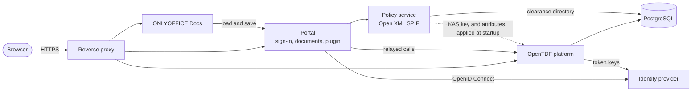

<div align="center">

# DCS ONLYOFFICE

**Data-centric security for ONLYOFFICE Docs: portion-level confidentiality labels following NATO STANAG 4774 and 4778.**

[](https://github.com/linagora/dcs-onlyoffice/actions/workflows/ci.yml)
[](LICENSE)


[Overview](#overview) · [Quick start](#quick-start) · [Architecture](#architecture) · [Configuration](#configuration) · [Development](#development) · [Roadmap](#roadmap) · [Contributing](CONTRIBUTING.md) · [Security](SECURITY.md)

</div>

## Overview

A document often mixes information of different sensitivity: a report releasable to partner nations may hold a few paragraphs restricted to one nation. Office suites label and handle such a document as a whole, so the restrictive parts are either removed or the whole document inherits the strictest marking and can no longer be shared.

DCS ONLYOFFICE lets authors insert **protected portions** into a document edited in ONLYOFFICE Docs:

- each portion carries its own **ADatP-4774 confidentiality label**, chosen from the labels that the security policy and the author's clearance allow;
- the protected text is typed in a side panel and **never reaches the document body**, which only shows a locked, coloured placeholder;
- that text is **encrypted in the author's browser** with [OpenTDF](https://opentdf.io) into an envelope stored in the file, next to the portion's label; its key is wrapped with **hybrid post-quantum key encapsulation**, and OpenTDF only hands it to **readers whose clearance allows the label**;
- the document carries a **label computed from its content**, stored as the standard **ADatP-4778.2 OOXML binding**, so that other labelling tools can read it;
- the security policy is never hard-coded: it is read from an **Open XML SPIF** file.

Iteration 3 is in progress: next, its demo is replayed on a hosted stack.

> [!IMPORTANT]
> This is a **demonstrator**, not a product. It uses fictional data and a fictional policy only, and is not hardened for production or for real classified information.

## Features

- **Single sign-on** with OpenID Connect (authorization code with PKCE); tokens stay on the server, the browser only holds a session cookie.
- **Document portal**: document list, new documents from templates, editing and read-only sessions, saving through the Document Server callbacks.
- **Labelling panel** in the editor: shows the signed-in user, offers new portions only the labels the signed-in person's clearance allows, inserts protected portions and highlights the portion under the cursor. For every portion it opens, it checks the label in clear against the label bound to the envelope, and shows the bound one, with a warning, when they differ. Entry points are also in the editor's context menu and **Insert** tab. The panel speaks English or French, following the editor's language.
- **Document label** computed from a base label and the portions' labels, with two rules: `clear-parts` (the base label plus an indicator when a portion is more restrictive) or `high-water-mark` (the ADatP-4774.1 dominant label).
- **Co-editing**: portions and the document label reach co-authors in real time; concurrent insertions converge to the right label.
- **Policy service**: Open XML SPIF 2.1 reader, valid labels and their rules, markings in several languages, ADatP-4774 serialization and the ADatP-4778.2 binding part.
- **OpenTDF platform** running and trusting the identity provider, behind a relay on the portal that adds the access token the portal keeps and refreshes, so that the plugin's calls never need a token in the browser.
- **Access by clearance**: each person's clearance is kept in a clearance directory, and OpenTDF refuses a portion's key to a reader whose clearance does not allow its label; the panel then shows "Access denied" next to the portion's marking.
- **Document access**: the portal opens a document only for people whose clearance allows its base label, which covers its content in clear; a document without one counts as the least restrictive label. The others see it listed as a restricted document, with its marking but not its name. Anyone may raise a base label; only administrators cleared for it are offered lower ones, and the portal logs every lowering.
- **Post-quantum key wrapping**: the browser wraps each portion's key for OpenTDF's hybrid key, ECDH P-384 combined with ML-KEM-1024 (`hpqt:secp384r1-mlkem1024`), with a build of the OpenTDF web SDK that adds hybrid key wrapping, proposed upstream in [opentdf/web-sdk#1049](https://github.com/opentdf/web-sdk/pull/1049). The key lives in OpenTDF's key registry, where the provisioning job creates it when the stack first starts; a test checks, on Chromium and Firefox, that a new portion's key is wrapped for it and read back.
- **Clearance administration**: members of the `dcs-maquette-admin` group see and edit every clearance on a portal page, among the choices the security policy offers; OpenTDF applies a change, a revocation for instance, at the next key request.
- **OpenTDF provisioned from the security policy**: the policy service derives OpenTDF's attributes, and the subject mappings that grant them to clearances, from the SPIF; a one-shot job applies them when the stack starts. A test checks that OpenTDF's decision is the policy's access decision for every demo account and label.
- **End-to-end tests** against the whole stack in CI, which keeps a trace, a screenshot and the saved DOCX files of every test.
- **Proof that no portion text reaches ONLYOFFICE**: every portion text the tests write carries a marker, which a test looks for in the editor's co-editing exchanges and the saved file, and the CI in the Document Server's working files, in clear, URL-encoded or in base64, as UTF-8 or UTF-16, archives included. Unencrypted portions, whose text goes through ONLYOFFICE by design, carry a canary instead, which the same searches must find.

## Quick start

Requirements: Docker with Compose v2. The tests also need Node.js 22.18 or later and pnpm 10.

```sh
git clone https://github.com/linagora/dcs-onlyoffice.git
cd dcs-onlyoffice
deploy/scripts/init-env.sh    # writes deploy/.env with fresh secrets
cd deploy
docker compose up -d --build --wait
```

The generated configuration enables the `standalone` profile: a local reverse proxy with its own certificate authority and a local LemonLDAP::NG identity provider with fictional accounts. Point the host names to your machine, for example in `/etc/hosts`:

```text
127.0.0.1 portail.dcs.test docs.dcs.test idp.dcs.test tdf.dcs.test
```

Then open <https://portail.dcs.test> and sign in as `alice`, `bob` or `chloe` (the password is the login); `dan` and `erin`, who hold no valid clearance, serve the tests. Your browser warns about the local certificate authority the first time.

To stop the stack and delete its data: `docker compose down -v`.

To run behind an existing reverse proxy with your own OpenID Connect provider, see [docs/hosting.md](docs/hosting.md).

## Architecture



| Component | Role | Technology |
| --- | --- | --- |
| `portal` | Sign-in, document list and storage, editor configuration, relays to the policy service and to OpenTDF, serves the plugin | Node.js, Fastify, `openid-client` |
| `plugin` | Labelling panel inside the editor | Preact, Vite, ONLYOFFICE plugin API, OpenTDF web SDK |
| `policy` | Reads SPIF files, validates labels, renders markings, computes the document label and its ADatP-4778.2 part, keeps the clearance directory, makes access decisions and derives OpenTDF's attributes | Node.js, Fastify, PostgreSQL |
| `opentdf-provisioning` | One-shot job: creates the KAS's hybrid key in OpenTDF's key registry, then applies to OpenTDF the attributes and subject mappings that the policy service derives, with an IdP client that OpenTDF makes an administrator | Node.js |
| ONLYOFFICE Docs | Document editing and co-editing | ONLYOFFICE Docs 9.4 Community Edition |
| OpenTDF | Key access and attribute-based access control; resolves each person's clearances from the clearance directory | OpenTDF platform 0.27 |
| Reverse proxy and IdP | Local TLS and fictional accounts in the `standalone` profile | Caddy, LemonLDAP::NG |

### What the document holds

- **Each portion** is a locked content control whose tag names the portion and its label, and whose content is a placeholder with the portion's marking. Its envelope, a ZTDF archive holding the encrypted text and the label as a bound assertion, and its ADatP-4774 label in clear sit in **one Custom XML part per portion** (`urn:linagora:dcs:portion:1`). Portions written before encryption keep their text in clear there; the panel still shows them, with a warning.
- **The document label** is stored as an ADatP-4778.2 `BindingInformation` part that references the package parts it covers, alongside a small part (`urn:linagora:dcs:document:1`) that keeps the base label.
- Custom XML parts survive saving to DOCX and reopening, and propagate to co-authors; the end-to-end tests prove both.

## Configuration

The stack reads `deploy/.env`, created from [`deploy/.env.example`](deploy/.env.example), which documents every setting.

| Setting | Purpose |
| --- | --- |
| `DOMAIN` | Public domain: host names are `portail.`, `docs.` and `tdf.` under it |
| `COMPOSE_PROFILES` | `standalone` for the local proxy and IdP, empty for the hosted mode |
| `OIDC_ISSUER`, `OIDC_CLIENT_ID`, `OIDC_CLIENT_SECRET`, `OIDC_SCOPES` | OpenID Connect provider and client |
| `OIDC_AUDIENCE` | Audience OpenTDF expects in access tokens (default `https://tdf.<DOMAIN>`) |
| `EDITOR_LANGUAGE` | Language of the editor and the labelling panel: `en` (default) or `fr`; `?lang=` in a document's address overrides it for one session |
| `MARKING_LANGUAGE` | Language of the rendered markings (default `fr`, from the demo SPIF) |
| `ROLLUP_RULE` | Document label rule: `clear-parts` (default) or `high-water-mark` |
| `PROXY_BIND` | Address the local reverse proxy of the `standalone` profile listens on (default `127.0.0.1`) |
| `BIND_ADDRESS`, `PORTAL_PORT`, `DOCS_PORT`, `TDF_PORT` | Published ports in the hosted mode |
| `ONLYOFFICE_JWT_SECRET` | Secret the portal and ONLYOFFICE Docs share to sign editor configurations and callbacks, generated by `init-env.sh` |
| `OPENTDF_DB_PASSWORD` | Password of the stack's PostgreSQL superuser, which only the database setup job uses, generated by `init-env.sh` |
| `OPENTDF_PLATFORM_DB_PASSWORD` | Password of the OpenTDF platform's database role, which may create schemas and owns the platform's, but has no right on the clearance directory, generated by `init-env.sh` |
| `DIRECTORY_DB_PASSWORD`, `DIRECTORY_READER_PASSWORD` | Passwords of the clearance directory's database roles, generated by `init-env.sh` |
| `DIRECTORY_ADMINISTRATION_SECRET` | Secret the portal shares with the policy service, which lets the portal alone change the clearance directory, generated by `init-env.sh` |
| `OPENTDF_PROVISIONER_CLIENT_SECRET` | Secret of `dcs-provisioner`, the IdP client of the provisioning job (client credentials grant only), generated by `init-env.sh` and shared with the local IdP |
| `OPENTDF_KAS_ROOT_KEY` | Root key of OpenTDF's key registry, which wraps the KAS's private keys in OpenTDF's database, generated by `init-env.sh`; without it, no envelope can be read |

The clearance directory starts from the JSON files of [`deploy/directory/seeds`](deploy/directory/seeds), which give the local IdP's fictional accounts their clearances; an entry that already exists is kept as it is. Files named `local-*.json` there are ignored by Git, for accounts with real addresses; the [hosting guide](docs/hosting.md#accounts-and-clearances) describes their format.

The demo policy is [`deploy/spif/demo-fr.spif.xml`](deploy/spif/demo-fr.spif.xml): a fictional French policy with four labels, NON PROTÉGÉ, DIFFUSION RESTREINTE, DIFFUSION RESTREINTE – SPÉCIAL FRANCE and DIFFUSION RESTREINTE – DIFFUSION OTAN. Drop other SPIF files in `deploy/spif` to use other policies. Each SPIF declares, in its extensions, the OpenTDF namespace of the attributes derived from it (the demo policy declares `demo-fr.dcs.linagora.com`, see [ADR 0003](docs/adr/0003-attribute-namespace-declared-by-the-security-policy.md)); without one, the policy's labels cannot be provisioned in OpenTDF.

## Development

```sh
pnpm install
pnpm typecheck                                            # every package
pnpm test                                                 # policy service API tests, no stack needed
pnpm --filter @dcs/e2e exec playwright install chromium firefox
pnpm e2e                                                  # end-to-end tests, against the running stack
pnpm --filter @dcs/e2e search-document-server             # then: no portion text among ONLYOFFICE's working files
```

The end-to-end suite runs on Chromium, and the browser-specific checks also run on Firefox. It needs the `standalone` stack running on `dcs.test`; the browsers resolve its host names on their own, no hosts file needed.

| Folder | Content |
| --- | --- |
| [`portal`](portal) | Host portal |
| [`plugin`](plugin) | ONLYOFFICE labelling plugin |
| [`policy`](policy) | Policy service and its API tests |
| [`e2e`](e2e) | Playwright end-to-end tests |
| [`deploy`](deploy) | Docker Compose stack, proxies, local IdP, OpenTDF configuration, demo SPIF and documents |
| [`docs`](docs) | Hosting guide and research notes on the standards, ONLYOFFICE, LemonLDAP::NG and OpenTDF |

See [CONTRIBUTING.md](CONTRIBUTING.md) for the conventions, commit rules and the pull request workflow.

## Roadmap

| Iteration | Scope | Status |
| --- | --- | --- |
| 1 | Stack, single sign-on, portal, labelling panel, policy service | Done |
| 2 | Protected portions without encryption, document label and ADatP-4778.2 binding, co-editing | Done |
| 3 | Encryption of portions with OpenTDF and hybrid post-quantum key encapsulation, clearance directory, access decisions | In progress |
| 4 | Editing existing portions, portion versions, header and footer markings, signed ADatP-4778 binding | Planned |
| 5 | Microsoft Purview label mapping, standalone packaging, demo script | Planned |
| 6 | Spreadsheet editor | Planned |

## Standards

- **STANAG 4774 / ADatP-4774**: confidentiality metadata label syntax.
- **STANAG 4778 / ADatP-4778**: metadata binding, with its OOXML profile ADatP-4778.2.
- **Open XML SPIF 2.1**: security policy information files ([xmlspif.org](http://www.xmlspif.org/)).
- **OpenTDF / ZTDF**: trusted data format and key access ([opentdf.io](https://opentdf.io)).

The tests compare the label and binding outputs with reference documents validated against the standards' schemas, and label verdicts with the spiffing reference implementation. The notes in [docs/research](docs/research) cite the sections they rely on.

## Security

Please do not report vulnerabilities in public issues: see [SECURITY.md](SECURITY.md), which also lists the demonstrator's known limitations. Among them, nothing prevents a reader from copying the decrypted text of a portion from the panel into the document body, where it is stored in clear.

## License

Copyright © 2026 LINAGORA.

This program is free software, released under the [GNU Affero General Public License v3.0](LICENSE). If you run a modified version on a server, you must offer its source code to the users of that server.

## Acknowledgements

Built on [ONLYOFFICE Docs](https://github.com/ONLYOFFICE/DocumentServer), [OpenTDF](https://github.com/opentdf/platform), [LemonLDAP::NG](https://lemonldap-ng.org) and [Caddy](https://caddyserver.com). Label verdicts in the tests were checked against [spiffing](https://github.com/surevine/spiffing).
