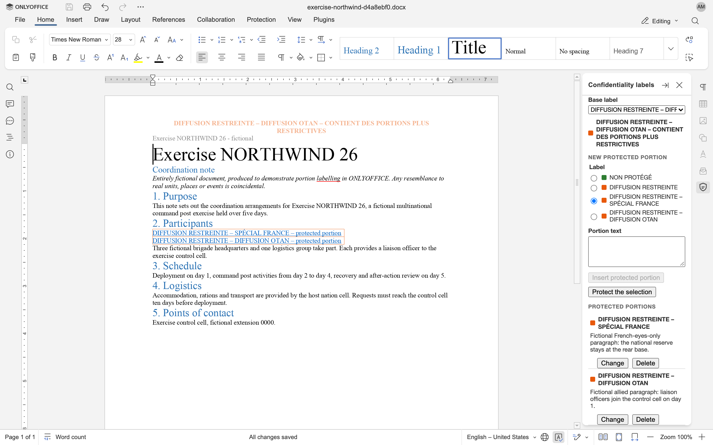
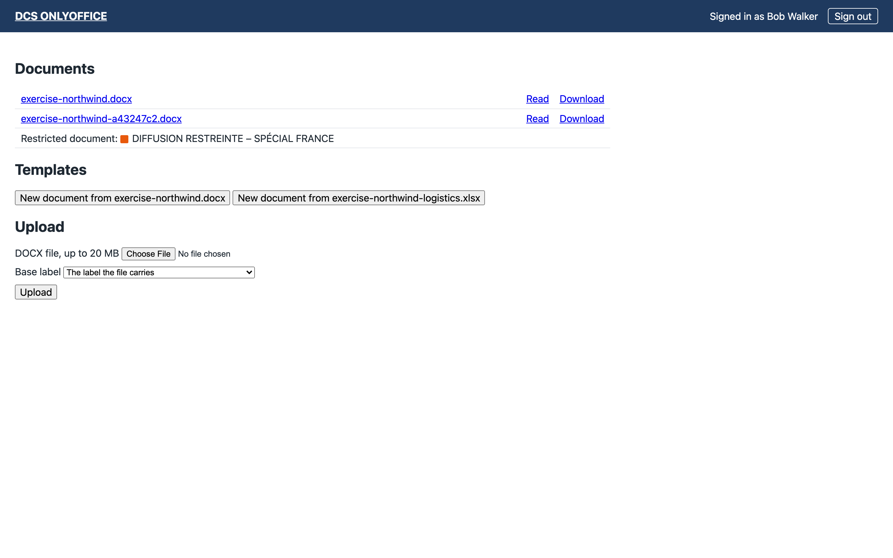
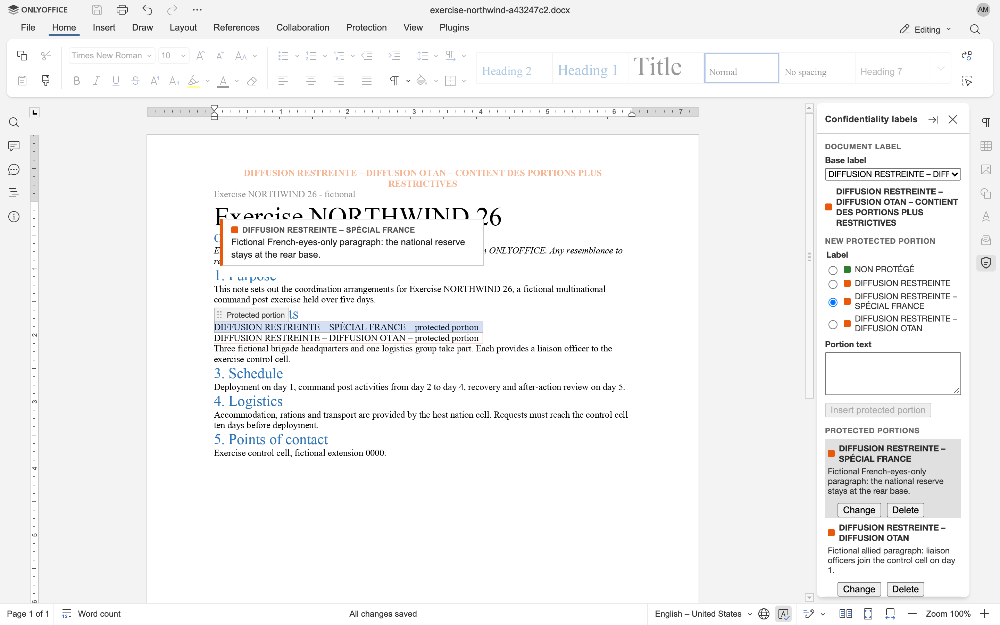
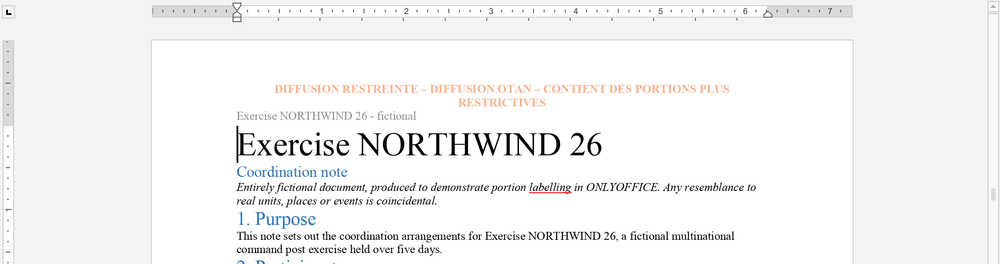
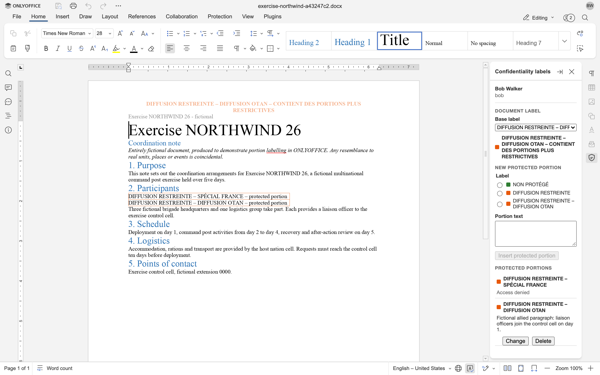
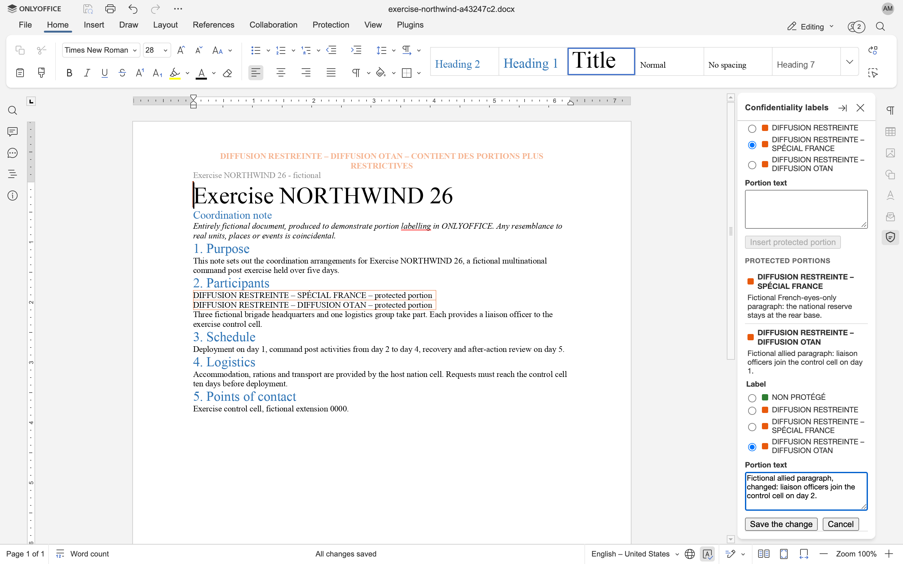
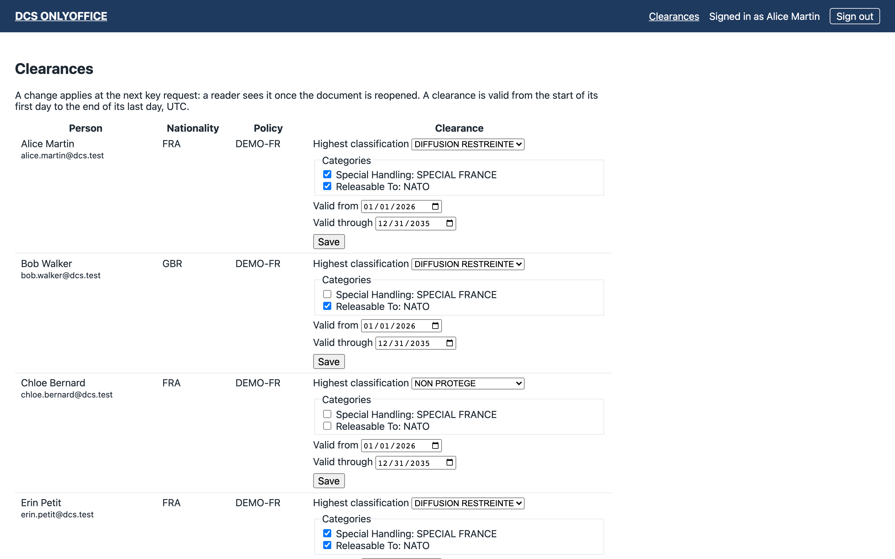
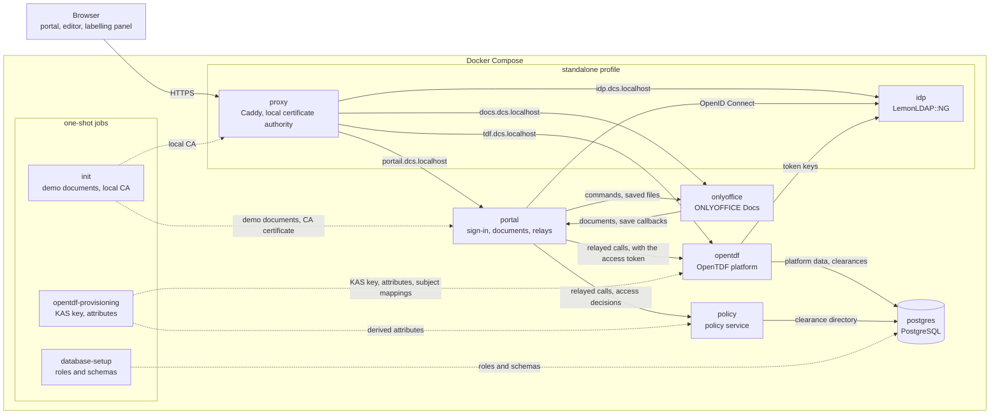

<div align="center">


# DCS ONLYOFFICE

**Data-centric security for ONLYOFFICE Docs: portion-level confidentiality labels following NATO STANAG 4774 and 4778, with each protected portion encrypted for the readers whose clearance allows its label.**

[](https://github.com/linagora/dcs-onlyoffice/actions/workflows/ci.yml)
[](LICENSE)
[](https://github.com/ONLYOFFICE/DocumentServer)
[](https://github.com/opentdf/platform)
[](#standards)
[](https://nodejs.org)
[](#features)

[Features](#features) · [Screenshots](#screenshots) · [Architecture](#architecture) · [Getting started](#getting-started) · [Configuration](#configuration) · [Tests](#tests) · [Roadmap](#roadmap) · [Contributing](#contributing)

</div>

<br>



## Overview

A document often mixes information of different sensitivity: a report releasable to partner nations may hold a few paragraphs restricted to one nation. Office suites label and handle such a document as a whole, so the restrictive parts are either removed or the whole document inherits the strictest marking and can no longer be shared.

DCS ONLYOFFICE lets authors insert protected portions into a document edited in ONLYOFFICE Docs. Each portion carries its own ADatP-4774 label, chosen among the labels that the security policy and the author's clearance allow. Its text is typed in a side panel, the labelling panel, and never reaches the document body, which only shows a locked, coloured placeholder. The author's browser encrypts that text with [OpenTDF](https://opentdf.io), wrapping its key with hybrid post-quantum key encapsulation, and OpenTDF only hands the key to readers whose clearance allows the label.

The document carries a label computed from its content, stored as the standard ADatP-4778.2 OOXML binding so that other labelling tools can read it, signed by the platform at each save, and marked at the top and the bottom of every page. The security policy is never hard-coded: it is read from an Open XML SPIF file.

The stack runs with Docker Compose: ONLYOFFICE Docs Community Edition, the OpenTDF platform, a portal that signs people in and stores the documents, a policy service and PostgreSQL, plus a local reverse proxy and identity provider for standalone use.

> [!IMPORTANT]
> This is a **demonstrator**, not a product. It uses fictional data and a fictional policy only, and is not hardened for production or for real classified information.

## Features

### For authors

- **Protected portions.** The author picks a label among those their clearance allows and types the text in the labelling panel, never in the document body. The portion goes after the paragraph that holds the cursor, as a locked placeholder that shows its marking, and holds at most 20,000 characters. The editor's context menu and **Insert** tab also start an insertion.
- **Labelling panel.** It shows the signed-in person, the document label and every protected portion, and highlights the portion that holds the cursor. It speaks English or French, following the editor's language.
- **Base label.** The author gives the document's unprotected content a base label, which decides who may open the document. Anyone may raise it; only cleared administrators are offered lower ones.
- **Changing a portion.** An author who can read a protected portion changes its text and its portion label from the panel, under a portion lock that one author holds at a time. The panel takes the lock from the policy service, renews it while its edit form stays open, and releases it once the change is saved or dropped. The labels offered are those the author's clearance allows that do not lower the current one; lower ones only to an administrator cleared for it. Co-authors see the portion being changed, with the author's name, then its new version. The file keeps only the latest envelope, and the portion version counts the changes.
- **Deleting a portion.** Under the same lock, an author who can read a protected portion deletes it from the panel once they confirm. One editor command removes its placeholder and its part, and writes the document label and the page marking again without it; co-authors' panels drop it.
- **Page marking.** The document label's marking, centred, in bold and in its colour, at the top and the bottom of every page. The panel writes it with the document label, after an insertion, a change, a deletion or a new base label, in a locked content control of its own that opens every header and closes every footer, first page and even pages included; the rest of a template's header and footer stays. An author whose panel finds the page marking missing, moved, changed by hand or stale, in a document labelled before page markings existed for instance, writes it again.
- **Co-editing.** Portions and the document label reach co-authors in real time, and concurrent insertions converge to the right label.
- **Workbooks.** A workbook, created from the workbook template, opens in ONLYOFFICE's spreadsheet editor with the labelling panel, which gives it its base label and shows its document label as in a text document, and in its read-only viewer, on the left, as in the text viewer. The portal decides who opens a workbook, signs its binding, writes its sensitivity label, checks its signature and journals its base label changes as a text document's, and downloads it as XLSX. A protected portion goes into empty cells the author selects: the panel merges them into a placeholder that shows the portion's marking in its label's colour, bold and bordered, locked by an ONLYOFFICE user protected range that lets no one type into it through the editor ([ADR 0006](docs/adr/0006-a-workbook-portion-is-a-user-protected-range.md)); cells that hold a value, a merge or another portion are refused. Changing and deleting a workbook's portions, following the selection and the page marking of sheets are not there yet, and uploads stay DOCX.

### For readers

- **Portion next to the cursor.** When the cursor enters a portion that its reader may read, a window next to the cursor, the bubble, shows the portion's marking and text. Its page runs on the portal's origin and gets the text from the panel inside the browser, never through ONLYOFFICE. It closes when the cursor leaves the portion or on Escape, and comes back on a click in the portion.
- **Access denied.** OpenTDF refuses a portion's key to a reader whose clearance does not allow its label: the panel then shows "Access denied" next to the portion's marking.
- **Bound label check.** For every portion it opens, the panel checks the label in clear against the label bound to the envelope, and shows the bound one, with a warning, when they differ.
- **Read-only viewer.** A document also opens read-only: the panel shows its portions and the bubble follows the cursor, but nothing can be inserted or changed, and the viewer writes nothing, not even the page marking.

### For administrators

- **Clearance administration.** Members of the `dcs-maquette-admin` group see and edit every clearance on a portal page, among the choices the security policy offers. OpenTDF applies a change, a revocation for instance, at the next key request.
- **Lowering a label.** Only administrators whose clearance allows the current base label, or the current portion label, are offered lower ones.
- **Journal of label changes.** The portal logs every change of a base label or a portion and every deletion of a portion made in the panel, with the person who made it, the labels and, for a portion, its versions; every upload, with the person, the document, the label the file carried and where it came from, whether the file's binding signature matched, and the base label kept, marked as a lowering when it is one; and every save that lowers a label in clear or removes a portion, with the people who held a configuration for the editing session. The journal never holds a document's text: `docker compose logs portal | grep -E 'Base label|Portion|Document uploaded'`.

### Portal

- **Single sign-on.** OpenID Connect, with the authorization code flow and PKCE. Tokens stay on the server: the browser only holds a session cookie.
- **Documents.** A document list, new text documents and workbooks from templates, new text documents from uploaded files, editing and read-only sessions, and saving through the Document Server's callbacks.
- **Uploads.** A person brings a DOCX of up to 20 MB into the portal. Its base label is the label the file carries: the base label the platform wrote in it, else the document label of an ADatP-4778 binding another tool wrote, else, with a label mapping, the label it pairs with the file's sensitivity label. The person may raise it, lower it only as an administrator whose clearance allows it, and chooses one among those their clearance allows when the file carries none. The policy service refuses a file that Microsoft Purview or a password encrypted, a legacy Office document, anything else that holds no Word document, and a label of another security policy or one the security policy does not define, each with its reason; otherwise it writes the base label's part and the binding, and signs it as at a save, sensitivity label included. The protected portions the file holds stay as they are. The new document keeps the uploaded file's name, and opens like the others.
- **Document access.** The portal opens a document only for people whose clearance allows its base label, which covers its content in clear; a document without one counts as the least restrictive label. The others see it listed as a restricted document, with its marking but not its name.
- **Editing sessions.** The portal decides again for whoever joins a document's editing session as an editor, and disconnects the people the base label excludes. When a new base label excludes someone who holds an editor configuration for the session, it ends the session for everyone, so that the Document Server refuses the earlier configurations.

### The document and the standards

- **ADatP-4774 labels.** Each portion label sits in the file in clear, for everyone and for other labelling tools, and bound in the portion's envelope.
- **Document label.** Computed from the base label and the portion labels, with one of two rules: `clear-parts` (the base label plus an indicator when a portion is more restrictive) or `high-water-mark` (the ADatP-4774.1 dominant label).
- **ADatP-4778.2 binding.** The document label is stored as the standard OOXML binding, which references the package parts it covers: those of ADatP-4778.2 Tables 5-2 and 5-3 that the package holds, WordprocessingML ones for a text document and SpreadsheetML ones for a workbook, whose chart styles count under the table's name and under the one Microsoft Excel and ONLYOFFICE write. The policy service brings that list of parts up to date at every save it signs.
- **Signed binding.** At each save it stores, the portal has the policy service compute the document label again from the labels in clear, replace a different one, which the portal logs, write the binding again and sign it as ADatP-4778.2 Annexes A and B lay out: an XML signature first in the binding, ECDSA P-256 with SHA-256 over SHA-384 digests, exclusive canonicalization, the certificate in `KeyInfo`, the package parts in a `Manifest` and the signing time in `SignatureProperties` ([ADR 0004](docs/adr/0004-the-policy-service-signs-the-document-label-binding.md)). The signature proves that the platform computed the label from the labels in clear and bound it to those parts when it stored the file, not who wrote the content; [SECURITY.md](SECURITY.md) tells what it leaves out. The tests check it with `xmlsec1`, an independent verifier.
- **Signature check.** Whenever the portal serves a stored file, to the Document Server or for a download, the policy service checks its signature against the configured certificate and digests the signed parts again. The portal logs a file that no longer matches its signature, or holds anything beside what it covers, with the parts that changed, and a file stored before signing existed, until its next save signs it; it serves both all the same.
- **Microsoft Purview sensitivity label.** At each save it stores, the policy service also writes the sensitivity label that a label mapping pairs with the document label, leaving out its informative categories, as the seven `MSIP_Label_*` custom document properties that Office reads, before it signs the binding, which covers them ([ADR 0005](docs/adr/0005-a-document-sensitivity-label-follows-its-document-label.md)). A DIFFUSION RESTREINTE document that holds SPECIAL FRANCE portions carries the DIFFUSION RESTREINTE sensitivity label. The label mapping of the standalone profile names a fictional tenant.
- **Security policy from a SPIF.** The policy service reads Open XML SPIF 2.1 files: valid labels and their rules, markings in several languages, ADatP-4774 serialization and the ADatP-4778.2 binding part. No policy name, label or rule is hard-coded.

### Encryption

- **OpenTDF envelopes.** The author's browser encrypts each portion's text into a ZTDF envelope, which also carries the portion label, bound to it, and the attribute values OpenTDF decides access with. The envelope sits in the file next to the label in clear.
- **Hybrid post-quantum key wrapping.** The browser wraps each portion's key for OpenTDF's hybrid key, ECDH P-384 combined with ML-KEM-1024 (`hpqt:secp384r1-mlkem1024`), with a build of the OpenTDF web SDK that adds hybrid key wrapping, proposed upstream in [opentdf/web-sdk#1049](https://github.com/opentdf/web-sdk/pull/1049). The key lives in OpenTDF's key registry, where the provisioning job creates it when the stack first starts.
- **Clearance directory.** Each person's clearance is kept in a clearance directory, apart from the identity provider, and OpenTDF reads it at every key request ([ADR 0002](docs/adr/0002-clearances-in-a-directory-read-by-opentdf.md)).
- **OpenTDF provisioned from the security policy.** The policy service derives OpenTDF's attributes, and the subject mappings that grant them to clearances, from the SPIF; a one-shot job applies them when the stack starts ([ADR 0003](docs/adr/0003-attribute-namespace-declared-by-the-security-policy.md)).
- **No token in the browser.** The plugin's OpenTDF calls go through a relay on the portal, which adds the access token the portal keeps and refreshes ([ADR 0001](docs/adr/0001-opentdf-calls-through-a-portal-relay.md)).

### What the project proves

- **No portion text reaches ONLYOFFICE.** Every portion text the tests write carries a marker. A test looks for it in the editor's co-editing exchanges and in the saved file, and the CI in the Document Server's working files, in clear, URL-encoded or in base64, as UTF-8 or UTF-16, archives included. Unencrypted portions, whose text goes through ONLYOFFICE by design, carry a canary instead, which the same searches must find.
- **OpenTDF decides as the security policy does.** A test checks that OpenTDF's decision is the policy's access decision for every demo account and label.
- **Hybrid keys in both browsers.** A test checks, on Chromium and Firefox, that a new portion's key is wrapped for the hybrid key and read back.
- **End-to-end tests in CI.** The CI starts the whole stack, runs the end-to-end tests against it, and keeps a trace, a screenshot and the saved DOCX files of every test.

## Screenshots

**Documents.** An allied officer's list: the documents their clearance opens, and a document for French eyes only, listed with its marking but not its name.



**Portion next to the cursor.** The bubble shows the marking and text of the portion that holds the cursor; the document body only holds its placeholder.



**Page marking.** The document label's marking opens every header, in the label's colour.



**Access denied.** In the allied officer's panel, the portion released to NATO shows its text, and the portion for French eyes only shows "Access denied".



**Changing a portion.** The author changes a portion's text in the panel, under its portion lock; co-authors see who is changing it, then its new version.



**Clearances.** Administrators edit every clearance of the clearance directory, among the choices of the security policy.



The screenshots are taken from the local stack, with fictional accounts and data, by `pnpm --filter @dcs/e2e captures` (see [e2e/captures](e2e/captures/captures.spec.ts)).

## Architecture



Each public service has a host name of its own under `DOMAIN`, `dcs.localhost` by default: `portail.`, `docs.` and `tdf.`, plus `idp.` for the local identity provider. In the `standalone` profile, the local reverse proxy also answers these names inside the Compose network, so that the portal, OpenTDF and the provisioning job reach the identity provider at the address browsers use. In the hosted mode, an existing reverse proxy and an external OpenID Connect provider take the place of the `standalone` profile's services ([docs/hosting.md](docs/hosting.md)).

The policy service, PostgreSQL and the local identity provider publish no port. The portal, ONLYOFFICE Docs and OpenTDF publish one port each on `BIND_ADDRESS`, loopback by default, for the reverse proxy of the hosted mode; the local reverse proxy listens on port 443 of `PROXY_BIND`. Both reverse proxies refuse the portal's `/internal/` path, which only the Document Server may call from the Compose network.

### Stack

| Component | Role | Technology |
| --- | --- | --- |
| `portal` | Sign-in, document list and storage, editor configuration, relays to the policy service and to OpenTDF, clearance administration page; serves the plugin | Node.js 22, [Fastify](https://fastify.dev) 5, [openid-client](https://github.com/panva/openid-client) 6 |
| `plugin` | Labelling panel and bubble inside the editor | [Preact](https://preactjs.com) 10, [Vite](https://vite.dev) 8, ONLYOFFICE plugin API, [OpenTDF web SDK](https://github.com/opentdf/web-sdk) 0.21 with hybrid key wrapping ([`plugin/vendor`](plugin/vendor/README.md)) |
| `policy` | Reads SPIF files, validates labels, renders markings, computes the document label and its ADatP-4778.2 part, signs that part at each save, holds portion locks, keeps the clearance directory, makes access decisions and derives OpenTDF's attributes | Node.js 22, Fastify 5, PostgreSQL, [xml-crypto](https://github.com/node-saml/xml-crypto) 6 |
| `opentdf-provisioning` | One-shot job: creates the KAS's hybrid key in OpenTDF's key registry, then applies to OpenTDF the attributes and subject mappings that the policy service derives, with an IdP client that OpenTDF makes an administrator | Node.js 22, in the policy service's image |
| `init`, `database-setup` | One-shot jobs: the demo documents and the local certificate authority; the roles and schemas of PostgreSQL | Shell scripts |
| `onlyoffice` | Document editing and co-editing | [ONLYOFFICE Docs](https://github.com/ONLYOFFICE/DocumentServer) 9.4 Community Edition, with one change ([`deploy/onlyoffice/Dockerfile`](deploy/onlyoffice/Dockerfile)) |
| `opentdf` | Key access and attribute-based access control; resolves each person's clearances from the clearance directory | [OpenTDF platform](https://github.com/opentdf/platform) 0.27 |
| `postgres` | OpenTDF's database and the clearance directory | [PostgreSQL](https://www.postgresql.org) 17 |
| `proxy`, `idp` | Local TLS and fictional accounts in the `standalone` profile | [Caddy](https://caddyserver.com) 2, [LemonLDAP::NG](https://lemonldap-ng.org) 2.23 |

ONLYOFFICE Docs' one change: its editors load ONLYOFFICE's analytics module, which the stack never enables, under a name that ad blockers allow, so that the editor also starts in a browser with an ad blocker.

Third-party images are pinned to exact versions in [`deploy/docker-compose.yml`](deploy/docker-compose.yml) and the Dockerfiles. ONLYOFFICE Docs, the OpenTDF platform and the BusyBox that runs OpenTDF's health check are also pinned by digest, in [`deploy/onlyoffice/Dockerfile`](deploy/onlyoffice/Dockerfile) and [`deploy/opentdf/Dockerfile`](deploy/opentdf/Dockerfile).

### What the document holds

- **Each portion** is a locked content control whose tag names the portion and its label, and whose content is a placeholder with the portion's marking. Its envelope, a ZTDF archive holding the encrypted text and the label as a bound assertion, and its ADatP-4774 label in clear sit in **one Custom XML part per portion** (`urn:linagora:dcs:portion:1`). Portions written before encryption keep their text in clear there; the panel still shows them, with a warning.
- **The document label** is stored as an ADatP-4778.2 `BindingInformation` part that references the package parts it covers, alongside a small part (`urn:linagora:dcs:document:1`) that keeps the base label. Its first child is the XML signature the policy service adds at each save.
- **The page marking** is a locked content control, first in every header and last in every footer, whose tag names the document label it shows and whose paragraph holds its marking. The first section has all three kinds of header and footer (default, first page, even pages); a later section only keeps the page marking in the ones of its own, the others showing the previous section's.
- **In a workbook**, a portion's placeholder is a merged range of cells that shows its marking, and an ONLYOFFICE user protected range over them, titled with the portion's id, that lists no editor; its Custom XML part is the same as in a text document, with the label in clear and the envelope. A portion counts when both its range and its part are there.
- Custom XML parts survive saving to DOCX and XLSX and reopening, and propagate to co-authors; the end-to-end tests prove both.

## Getting started

### Run the stack locally

Requirements: Docker with Compose v2, and OpenSSL, which generates the secrets. The tests also need Node.js 22.18 or later and pnpm 10. The `standalone` stack runs entirely on your machine, with fictional accounts, a fictional security policy and fictional documents.

```sh
git clone https://github.com/linagora/dcs-onlyoffice.git
cd dcs-onlyoffice
deploy/scripts/start.sh
```

The script writes `deploy/.env` from `deploy/.env.example` with fresh secrets on its first run; later runs reuse it, and only set the secrets an upgrade brings. Then it builds the stack's images, starts the stack, waits until it is healthy, and prints the addresses and the accounts. The configuration enables the `standalone` profile, the only one the script starts: a local reverse proxy with its own certificate authority, and a local LemonLDAP::NG identity provider with fictional accounts, on the domain `dcs.localhost`. Chrome and Firefox reach its host names without any change; with another browser, such as Safari, point them to your machine, for example in `/etc/hosts`:

```text
127.0.0.1 portail.dcs.localhost docs.dcs.localhost idp.dcs.localhost tdf.dcs.localhost
```

| Service | Address |
| --- | --- |
| Portal | <https://portail.dcs.localhost> |
| ONLYOFFICE Docs | <https://docs.dcs.localhost> |
| OpenTDF platform | <https://tdf.dcs.localhost> |
| Local identity provider | <https://idp.dcs.localhost> |

Your browser warns about the local certificate authority the first time. To stop the stack and delete its data: `docker compose down -v`, in `deploy`.

Sign in with one of the fictional accounts below: the password is the login.

| Account | Name | Nationality | Role | Clearance under the demo policy |
| --- | --- | --- | --- | --- |
| `alice` | Alice Martin | FRA | Administrator (`dcs-maquette-admin`) | DIFFUSION RESTREINTE, with SPECIAL FRANCE and Releasable To NATO |
| `bob` | Bob Walker | GBR | User | DIFFUSION RESTREINTE, with Releasable To NATO |
| `chloe` | Chloe Bernard | FRA | User | NON PROTEGE |
| `dan` | Dan Moreau | | User, for the tests | None |
| `erin` | Erin Petit | FRA | User, for the tests | DIFFUSION RESTREINTE, with SPECIAL FRANCE and Releasable To NATO, ended at the end of 2025 |

`alice` reads every label of the demo policy, `bob` every label but DIFFUSION RESTREINTE – SPÉCIAL FRANCE, and `chloe` only NON PROTÉGÉ. `dan` and `erin`, who hold no valid clearance, open no document. The accounts come from [`deploy/idp/users.json`](deploy/idp/users.json), their clearances from [`deploy/directory/seeds/demo.json`](deploy/directory/seeds/demo.json).

### Walk through the demo

[docs/walkthrough.md](docs/walkthrough.md) follows the demo scenario step by step, with pictures: a base label, portions, co-editing, a change the co-author sees, a raise to SPÉCIAL FRANCE that shuts the allied officer out, a deletion, the page markings, the signed binding, a revocation and an upload. `pnpm --filter @dcs/e2e demo` replays it with a video of each person's browser, and the CI keeps each run's videos for 14 days.

### Deploy

[docs/hosting.md](docs/hosting.md) describes the hosted mode, behind an existing reverse proxy that terminates TLS and with your own OpenID Connect provider: DNS and TLS, the two clients to register at the provider, the settings of `deploy/.env`, the hosted accounts' clearances, the nginx site of [`deploy/nginx`](deploy/nginx/dcs.conf.template), and the checks once the stack runs.

## Configuration

The stack reads `deploy/.env`, created from [`deploy/.env.example`](deploy/.env.example), which documents every setting. After an upgrade, run `deploy/scripts/init-env.sh` again: it adds the secrets a new version introduces and changes nothing else.

| Setting | Purpose |
| --- | --- |
| `DOMAIN` | Public domain: host names are `portail.`, `docs.` and `tdf.` under it |
| `COMPOSE_PROFILES` | `standalone` for the local proxy and IdP, empty for the hosted mode |
| `OIDC_ISSUER`, `OIDC_CLIENT_ID`, `OIDC_CLIENT_SECRET`, `OIDC_SCOPES` | OpenID Connect provider and client |
| `OIDC_AUDIENCE` | Audience OpenTDF expects in access tokens (default `https://tdf.<DOMAIN>`) |
| `EDITOR_LANGUAGE` | Language of the editor and the labelling panel: `en` (default) or `fr`; `?lang=` in a document's address overrides it for one session |
| `MARKING_LANGUAGE` | Language of the rendered markings (default `fr`, from the demo SPIF) |
| `ROLLUP_RULE` | Document label rule: `clear-parts` (default) or `high-water-mark` |
| `PORTION_LOCK_LEASE_SECONDS` | How long an author keeps a portion lock without renewing it: 300 by default; `deploy/.env.example` sets 20 for the standalone profile's tests |
| `LABEL_MAPPING_FILE` | The label mapping of a Microsoft 365 tenant, in the policy service's container: `deploy/.env.example` sets the example of the demo policy, which names a fictional tenant; empty, no sensitivity label is written |
| `PROXY_BIND` | Address the local reverse proxy of the `standalone` profile listens on (default `127.0.0.1`) |
| `BIND_ADDRESS`, `PORTAL_PORT`, `DOCS_PORT`, `TDF_PORT` | Published ports in the hosted mode |
| `ONLYOFFICE_JWT_SECRET` | Secret the portal and ONLYOFFICE Docs share to sign editor configurations, callbacks and the Document Server's downloads, generated by `init-env.sh` |
| `OPENTDF_DB_PASSWORD` | Password of the stack's PostgreSQL superuser, which only the database setup job uses, generated by `init-env.sh` |
| `OPENTDF_PLATFORM_DB_PASSWORD` | Password of the OpenTDF platform's database role, which may create schemas and owns the platform's, but has no right on the clearance directory, generated by `init-env.sh` |
| `DIRECTORY_DB_PASSWORD`, `DIRECTORY_READER_PASSWORD` | Passwords of the clearance directory's database roles, generated by `init-env.sh` |
| `DIRECTORY_ADMINISTRATION_SECRET` | Secret the portal shares with the policy service, which lets the portal alone change the clearance directory, generated by `init-env.sh` |
| `BINDING_SIGNING_KEY`, `BINDING_SIGNING_CERTIFICATE` | The ECDSA P-256 key that signs document label bindings and its certificate, as base64-encoded PEM: `init-env.sh` generates a demo key with a self-signed certificate |
| `BINDING_SIGNATURE_SECRET` | Secret the portal shares with the policy service to have bindings signed, generated by `init-env.sh` |
| `OPENTDF_PROVISIONER_CLIENT_SECRET` | Secret of `dcs-provisioner`, the IdP client of the provisioning job (client credentials grant only), generated by `init-env.sh` and shared with the local IdP |
| `OPENTDF_KAS_ROOT_KEY` | Root key of OpenTDF's key registry, which wraps the KAS's private keys in OpenTDF's database, generated by `init-env.sh`; without it, no envelope can be read |

The clearance directory starts from the JSON files of [`deploy/directory/seeds`](deploy/directory/seeds), which give the local IdP's fictional accounts their clearances; an entry that already exists is kept as it is. Files named `local-*.json` there are ignored by Git, for accounts with real addresses; the [hosting guide](docs/hosting.md#accounts-and-clearances) describes their format.

The demo policy is [`deploy/spif/demo-fr.spif.xml`](deploy/spif/demo-fr.spif.xml): a fictional French policy with four labels, NON PROTÉGÉ, DIFFUSION RESTREINTE, DIFFUSION RESTREINTE – SPÉCIAL FRANCE and DIFFUSION RESTREINTE – DIFFUSION OTAN. Drop other SPIF files in `deploy/spif` to use other policies. Each SPIF declares, in its extensions, the OpenTDF namespace of the attributes derived from it (the demo policy declares `demo-fr.dcs.linagora.com`, see [ADR 0003](docs/adr/0003-attribute-namespace-declared-by-the-security-policy.md)); without one, the policy's labels cannot be provisioned in OpenTDF. Its example label mapping, [`deploy/spif/demo-fr.label-mapping.json`](deploy/spif/demo-fr.label-mapping.json), pairs each of the four labels with a sensitivity label of a fictional tenant; the [hosting guide](docs/hosting.md#configuration) describes its format.

## Tests

| Command | Scope |
| --- | --- |
| `pnpm typecheck` | Type checks of every package |
| `pnpm test` | Policy service API tests, in process with `node:test`: no stack needed |
| `pnpm e2e` | End-to-end tests with [Playwright](https://playwright.dev) against the running `standalone` stack, on Chromium; the browser-specific checks also run on Firefox |
| `pnpm --filter @dcs/e2e search-document-server` | After the end-to-end tests: no portion text among the Document Server's working files, where the canaries must be found |
| `pnpm --filter @dcs/e2e check-internal-route` | The portal's internal route serves a document only to a Document Server token for that document |
| `pnpm --filter @dcs/e2e captures` | Screenshots of this README |

Install the browsers once with `pnpm --filter @dcs/e2e exec playwright install chromium firefox`. The end-to-end tests need the `standalone` stack running, on the `DOMAIN` of `deploy/.env`, and no hosts file: under `.localhost`, their browsers resolve the host names by themselves, which the tests thus check; under another domain, the test configuration leads the names to the local reverse proxy.

The CI runs the type checks and the API tests, then starts the `standalone` stack and checks, in order: that provisioning OpenTDF again changes nothing; that OpenTDF connects with a database role that cannot reach the clearance directory; the portal's internal route; the end-to-end tests, on Chromium and Firefox; the Document Server's working files, searched for portion texts; and that the database setup hands the platform's objects over to its role, ignoring what that role plants in its search path.

## Repository layout

| Path | Content |
| --- | --- |
| [`portal/`](portal) | Host portal: sign-in, documents, editor configuration, relays, clearance administration page |
| [`plugin/`](plugin) | ONLYOFFICE labelling plugin: panel and bubble, and the build of the OpenTDF web SDK it uses |
| [`policy/`](policy) | Policy service and its API tests, and the OpenTDF provisioning job |
| [`e2e/`](e2e) | Playwright end-to-end tests, the searches of the Document Server, the README's screenshot captures |
| [`deploy/`](deploy) | Docker Compose stack, proxies, local IdP, OpenTDF configuration, PostgreSQL setup, demo SPIF, clearances and documents |
| [`docs/`](docs) | Hosting guide, architecture decisions, research notes on the standards, ONLYOFFICE, LemonLDAP::NG and OpenTDF, screenshots |
| [`CONTEXT.md`](CONTEXT.md) | Glossary of the project's domain |

## Roadmap

Iteration 5 is done: the Microsoft Purview sensitivity label written at each save and read at upload, uploads, the one-command start and the demo walkthrough. Two checks by hand remain, the demo on a hosted stack with corporate accounts and a look in Microsoft Word at the sensitivity label of stored documents. Iteration 6, workbooks in the spreadsheet editor, comes next.

| Iteration | Scope | Status |
| --- | --- | --- |
| 1 | Stack, single sign-on, portal, labelling panel, policy service | Done |
| 2 | Protected portions without encryption, document label and ADatP-4778.2 binding, co-editing | Done |
| 3 | Encryption of portions with OpenTDF and hybrid post-quantum key encapsulation, clearance directory, access decisions | Done |
| 4 | Editing existing portions, portion versions, header and footer markings, signed ADatP-4778 binding | Done |
| 5 | Microsoft Purview sensitivity labels, uploads, one-command start, demo walkthrough | Done |
| 6 | Workbooks in the spreadsheet editor | Planned |

## Standards

- **STANAG 4774 / ADatP-4774.** Confidentiality metadata label syntax.
- **STANAG 4778 / ADatP-4778.** Metadata binding, with its OOXML profile ADatP-4778.2.
- **Open XML SPIF 2.1.** Security policy information files ([xmlspif.org](http://www.xmlspif.org/)).
- **OpenTDF / ZTDF.** Trusted data format and key access ([opentdf.io](https://opentdf.io)).

The tests compare the label and binding outputs with reference documents validated against the standards' schemas, and label verdicts with the spiffing reference implementation. The notes in [docs/research](docs/research) cite the sections they rely on.

## Contributing

Contributions are welcome: see [CONTRIBUTING.md](CONTRIBUTING.md) for the development environment, the checks and the conventions. Everything in this repository is written in English; the labelling panel's texts exist in English and French.

## Security

Please do not report vulnerabilities in public issues: see [SECURITY.md](SECURITY.md), which also lists the demonstrator's known limitations. Among them, nothing prevents a reader from copying the decrypted text of a portion from the panel into the document body, where it is stored in clear.

## License

Copyright © 2026 [LINAGORA](https://linagora.com).

DCS ONLYOFFICE is free software, released under the [GNU Affero General Public License v3.0](LICENSE). If you run a modified version on a server, you must offer its source code to the users of that server.

## Acknowledgements

Built on [ONLYOFFICE Docs](https://github.com/ONLYOFFICE/DocumentServer), [OpenTDF](https://github.com/opentdf/platform), [LemonLDAP::NG](https://lemonldap-ng.org) and [Caddy](https://caddyserver.com). Label verdicts in the tests were checked against [spiffing](https://github.com/surevine/spiffing).
