# Demo walkthrough

The demo scenario, step by step, on the standalone stack and its fictional accounts: in a text document, then, from step 12, in a workbook. Alice Martin, a French officer and an administrator, is cleared for every label of the demo security policy; Bob Walker, an allied officer, for every label but DIFFUSION RESTREINTE – SPÉCIAL FRANCE. The documents, their portions and every text below are fictional.

`pnpm --filter @dcs/e2e demo` replays the same scenario and records a video of each person's browser, `alice.webm` and `bob.webm`, under `e2e/test-results/demo`; the CI replays it after the end-to-end suite and keeps the videos for 14 days, as the `demo-videos` artefact of each run. The pictures below come from the same scenario, taken with `pnpm --filter @dcs/e2e captures` on a fresh stack.

## Before you start

Start the stack with `deploy/scripts/start.sh`, as the [README](../README.md#run-the-stack-locally) shows, and open the portal in two browsers, or in a normal and a private window: one for Alice, signed in as `alice`, one for Bob, signed in as `bob`. The password is the login.

## 1. A base label

Alice creates a document from the `exercise-northwind.docx` template, on the portal's home page. In the labelling panel, on the right of the editor, she gives it the base label DIFFUSION RESTREINTE, which decides who may open the document. The document label follows, and so does the page marking at the top and the bottom of every page.

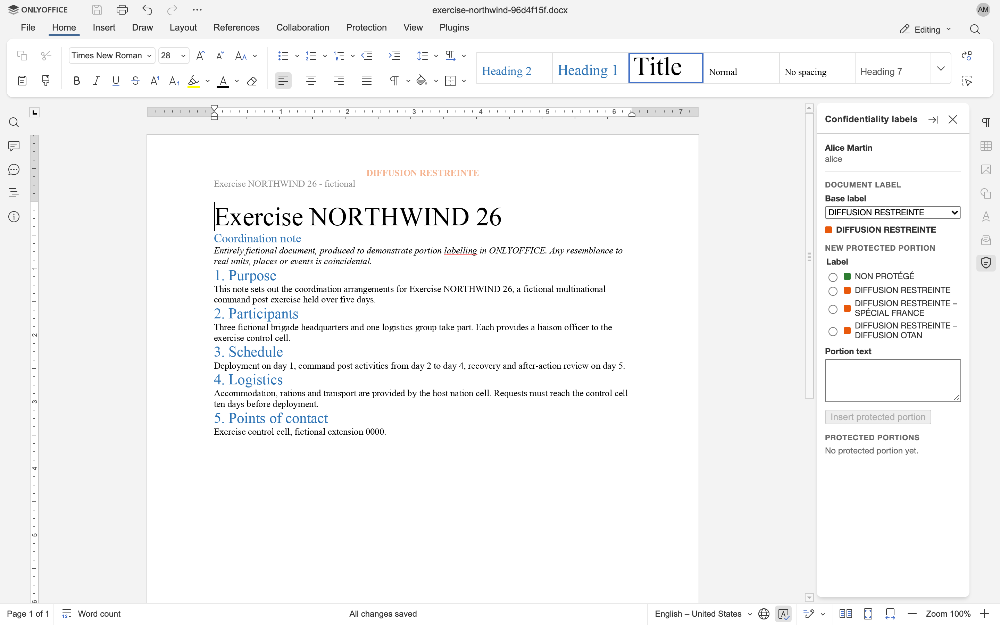

## 2. Protected portions

Under **New protected portion**, Alice picks the label DIFFUSION RESTREINTE, types a text in **Portion text**, never in the document itself, and inserts it: the document only shows a locked placeholder with the portion's marking, and the text goes, encrypted, into the portion's envelope. ONLYOFFICE never receives it. She inserts a second portion the same way.

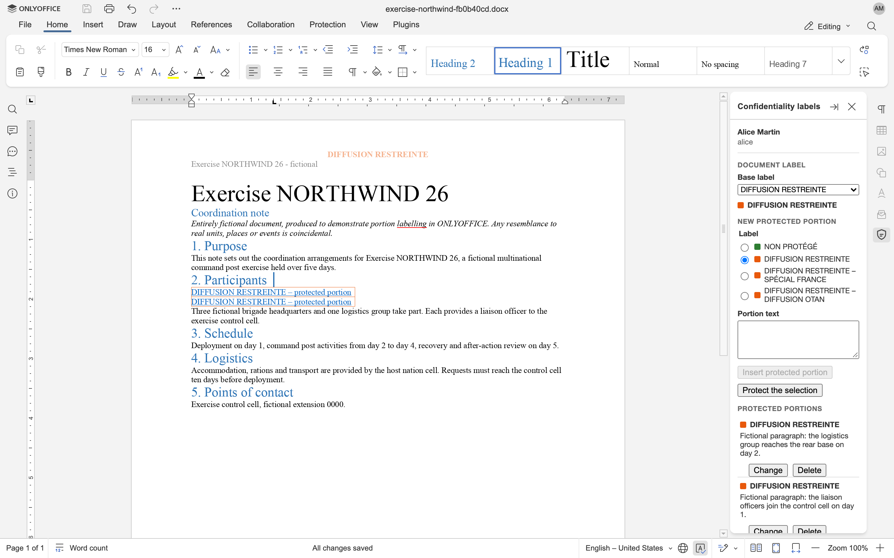

## 3. Co-editing

Bob finds the document on his home page and opens it: the two of them now edit it together, and his panel reads both portions, whose labels his clearance allows.

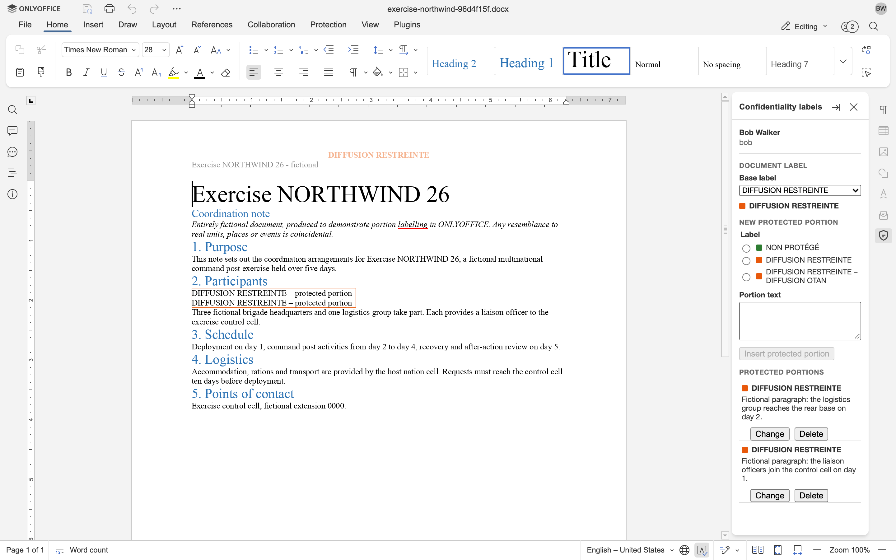

## 4. A change the co-author sees

Alice clicks **Change** on the first portion. She holds its portion lock while she types the new text: Bob's panel shows the portion being changed, and by whom. Once she saves the change, Bob reads the new text.

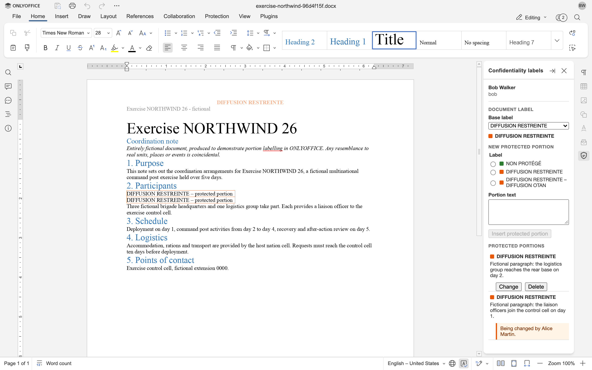

## 5. A raise to SPÉCIAL FRANCE

Alice changes the first portion again, and raises its label to DIFFUSION RESTREINTE – SPÉCIAL FRANCE. The portion's envelope now carries that label, and OpenTDF refuses Bob the key to it: his panel shows "Access denied" next to the portion's marking. The rest of the document stays open to him, and the document label now reads DIFFUSION RESTREINTE – CONTIENT DES PORTIONS PLUS RESTRICTIVES: the base label, and an indicator that a portion is more restrictive.

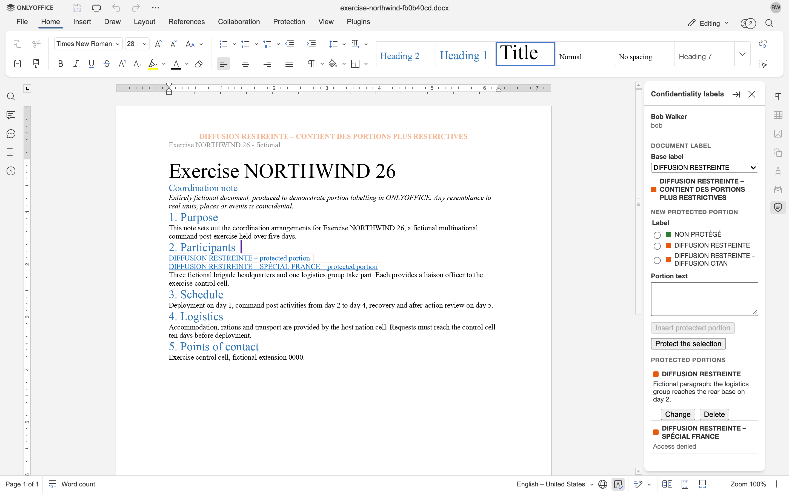

## 6. A deletion

Alice clicks **Delete** on the second portion and confirms: it leaves both panels, with its placeholder and its part. The document label stays as it was, since the portion raised to SPÉCIAL FRANCE remains.

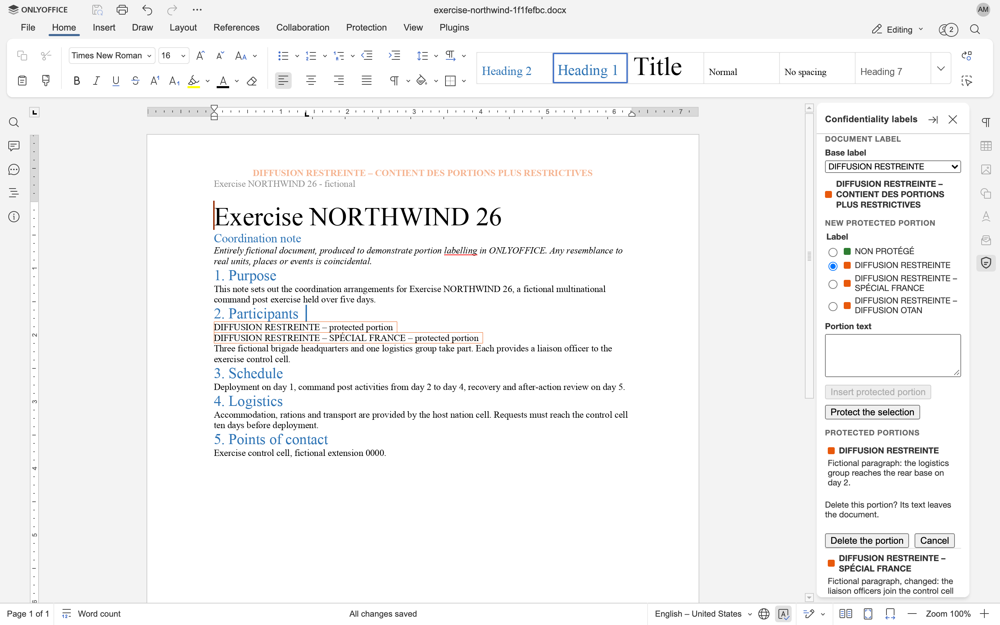

## 7. The page markings

The page marking follows the document label, in a locked control of its own at the top and the bottom of every page.

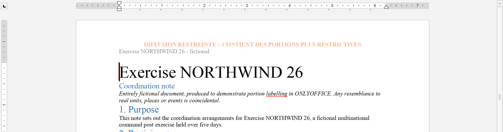

## 8. The signed binding

Once both leave the editor, the Document Server stores the document. At that save, the policy service computed the document label again from the labels in clear, bound it to the file's parts as ADatP-4778.2 prescribes, and signed that binding. To check it with `xmlsec1`, an independent verifier, download the document from the list and follow the check of [docs/hosting.md](hosting.md#checks) with the certificate of the stack's demo authority, the first of the `BINDING_TRUST_ANCHORS` of `deploy/.env`: the line `Manifests References (ok/all)` shows every part as matching. The portal also checks the signature whenever it serves the stored file: in `deploy`, `docker compose logs portal | grep 'Stored file'` shows a file changed outside the platform. No page of the platform shows the binding, so this step has no picture.

## 9. A revocation

Alice, an administrator, opens **Clearances** from the portal's header, and ends Bob's clearance: its last valid day becomes yesterday. When Bob opens the document again, the portal refuses it, and shows only its base label's marking. The replay then gives Bob his clearance back; by hand, set its last valid day to 2035-12-31 again.

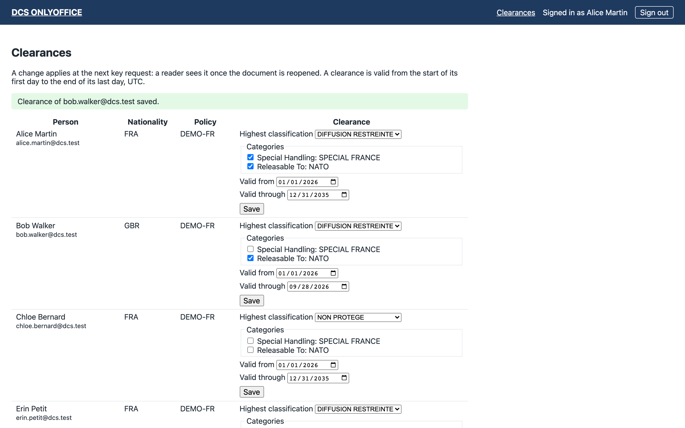

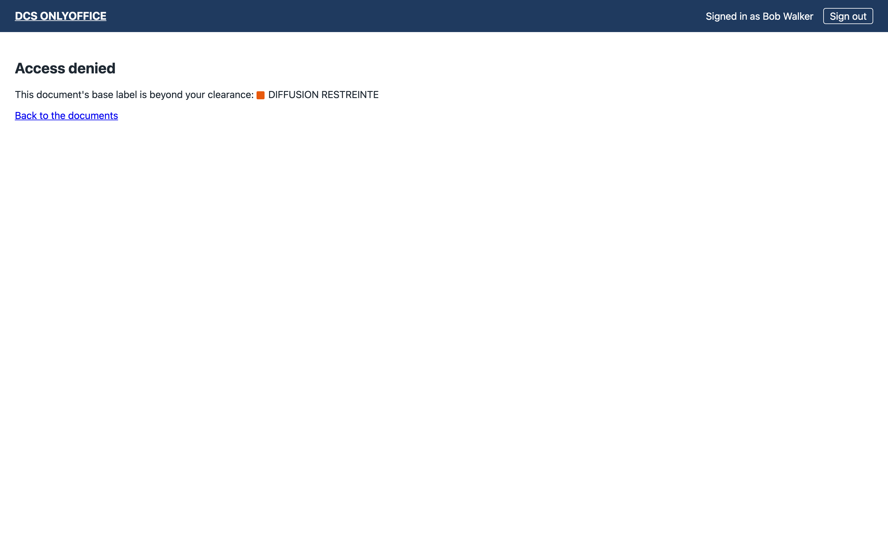

## 10. An upload

On the home page, Alice uploads a Word file that a Microsoft 365 tenant labelled, [`deploy/demo/uploads/fictional-report-labelled-in-microsoft-365.docx`](../deploy/demo/uploads/fictional-report-labelled-in-microsoft-365.docx), keeping **The label the file carries** as its base label. The file's sensitivity label belongs to the fictional tenant of the example label mapping (`deploy/spif/demo-fr.label-mapping.json`), which pairs it with DIFFUSION RESTREINTE – DIFFUSION OTAN: the document opens with that base label. A file labelled in a real tenant needs a label mapping of that tenant's own, as [docs/hosting.md](hosting.md) describes.

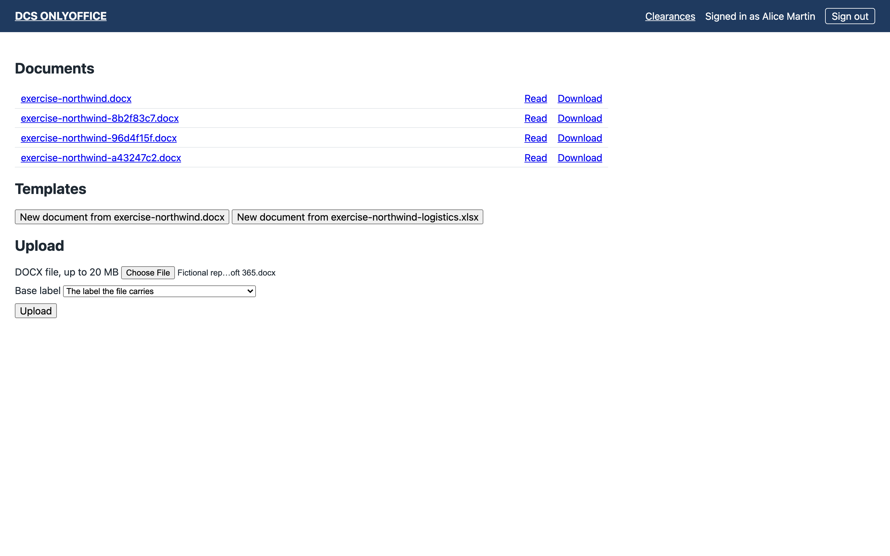

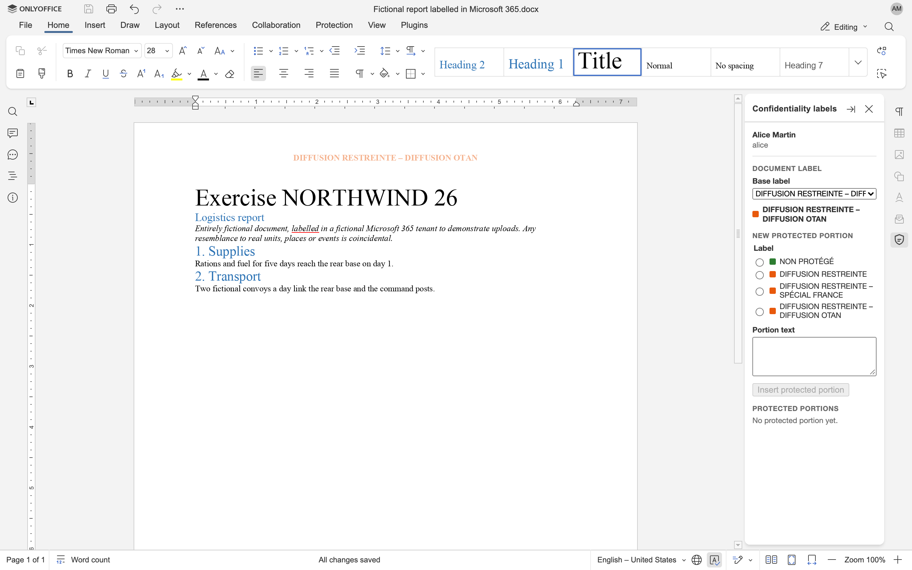

## 11. A paragraph already written, protected

The report's paragraph on transport turns out to be for French eyes only. Alice selects it, picks DIFFUSION RESTREINTE – SPÉCIAL FRANCE and presses **Protect the selection**, rather than retype its text into a new portion. The panel shows the plain text of the whole paragraphs the selection touches, and warns that it already went through ONLYOFFICE in clear: it is protected from now on only, and copies made before, such as the editor's working files of this session, keep it. Once she confirms, the text goes, encrypted, into a new portion's envelope, and the portion's placeholder takes the paragraph's place. The document label reads DIFFUSION RESTREINTE – DIFFUSION OTAN – CONTIENT DES PORTIONS PLUS RESTRICTIVES. The editor's context menu offers the same action.

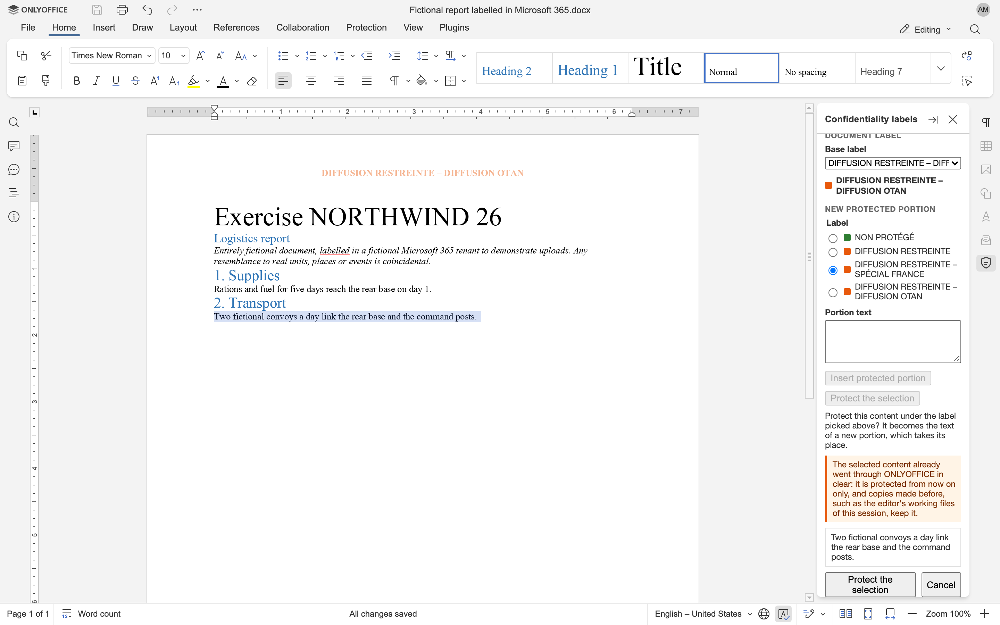

## 12. A workbook

The same scenario goes on in a workbook. Alice creates one from the `exercise-northwind-logistics.xlsx` template, which opens in ONLYOFFICE's spreadsheet editor with the same labelling panel, and gives it the base label DIFFUSION RESTREINTE. Above and below the editor, the portal's page shows the document label in its colour, the workbook's screen marking, which follows each label the panel computes.

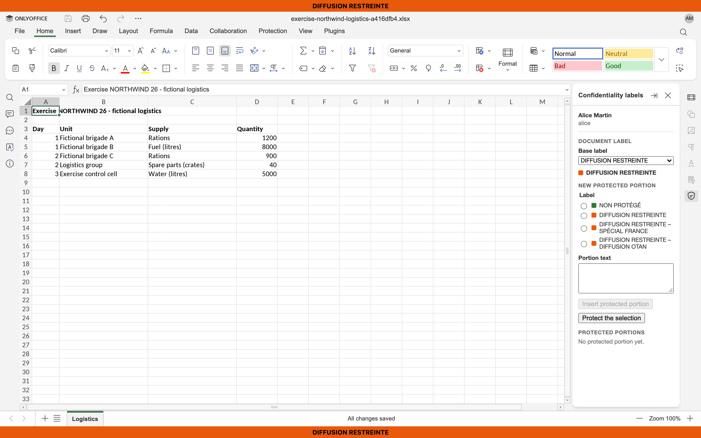

## 13. Portions in cells

Alice selects empty cells, picks a label and types a text in the panel, as in the text document: the panel merges the cells into a placeholder that shows the portion's marking in its label's colour, and locks it, so that no one can type into it. The text goes, encrypted, into the portion's envelope. She inserts a second portion into other empty cells.

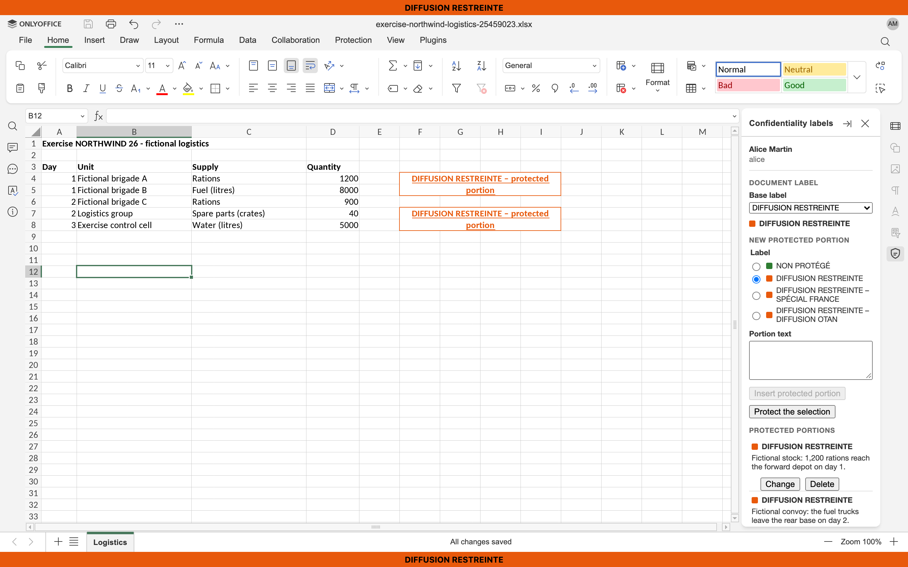

## 14. Co-editing a workbook

Bob opens the workbook: his panel reads both portions. When he selects a placeholder, the panel highlights its portion, and a bubble shows him its text over the placeholder.

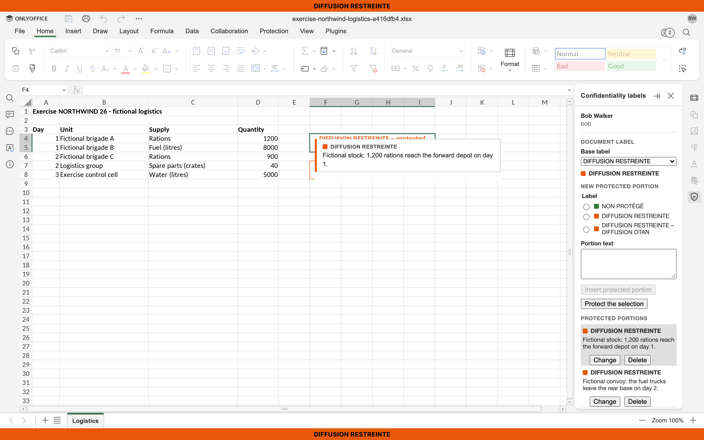

## 15. A change the co-author sees

Alice changes the first portion under its portion lock, as in the text document: Bob's panel shows the portion being changed, and by whom, then its new text.

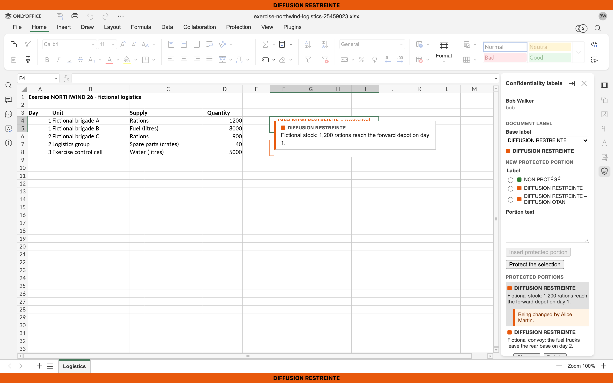

## 16. A raise to SPÉCIAL FRANCE

Alice raises the first portion to DIFFUSION RESTREINTE – SPÉCIAL FRANCE: its placeholder shows the new marking, and Bob's panel shows "Access denied". The document label reads DIFFUSION RESTREINTE – CONTIENT DES PORTIONS PLUS RESTRICTIVES.

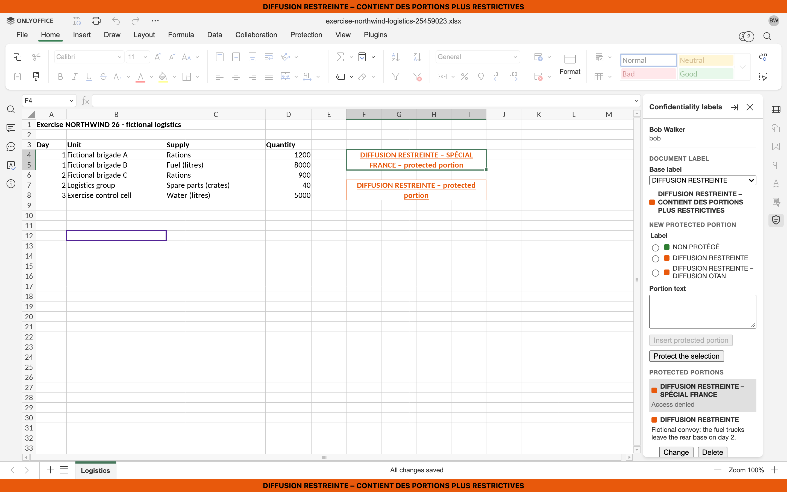

## 17. A deletion

Alice deletes the second portion: it leaves both panels, and its cells are empty again, for anyone to type into.

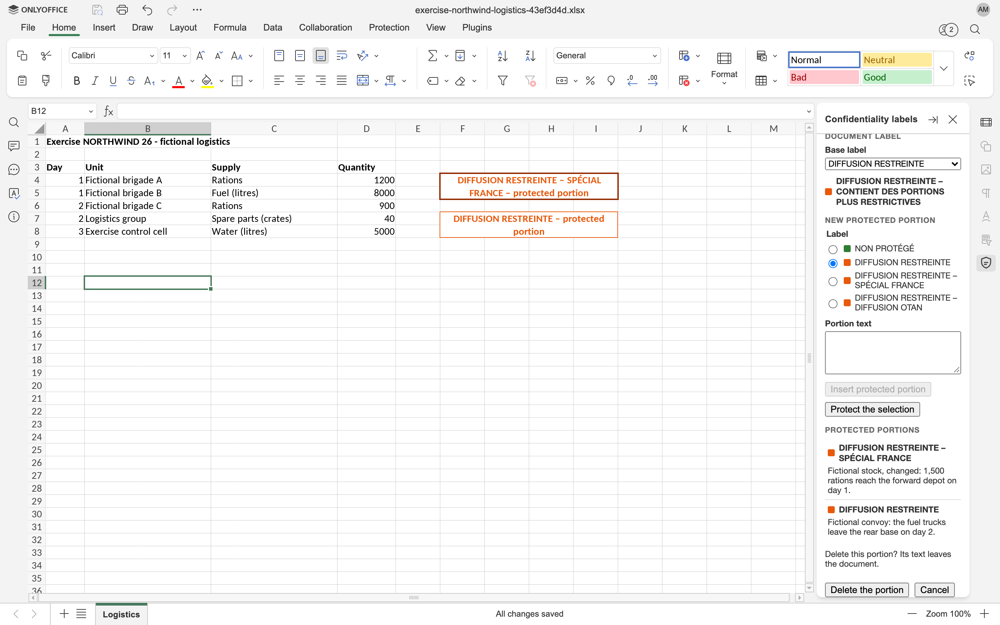

## 18. Rows already filled, protected

The last two rows of supplies turn out to be for French eyes only. Alice selects them, cells already filled that a portion's insertion refuses, picks DIFFUSION RESTREINTE – SPÉCIAL FRANCE and presses **Protect the selection**. The panel shows their values as the portion will hold them, rows of tab-separated cells, and warns that they already went through ONLYOFFICE in clear: they are protected from now on only, and copies made before, such as the editor's working files of this session, keep them. Once she confirms, the values go, encrypted, into a new portion's envelope, and the rows become its placeholder: Bob's panel shows "Access denied". The editor's context menu offers the same action, as for a paragraph in [step 11](#11-a-paragraph-already-written-protected). The journal records the protection, never the values.

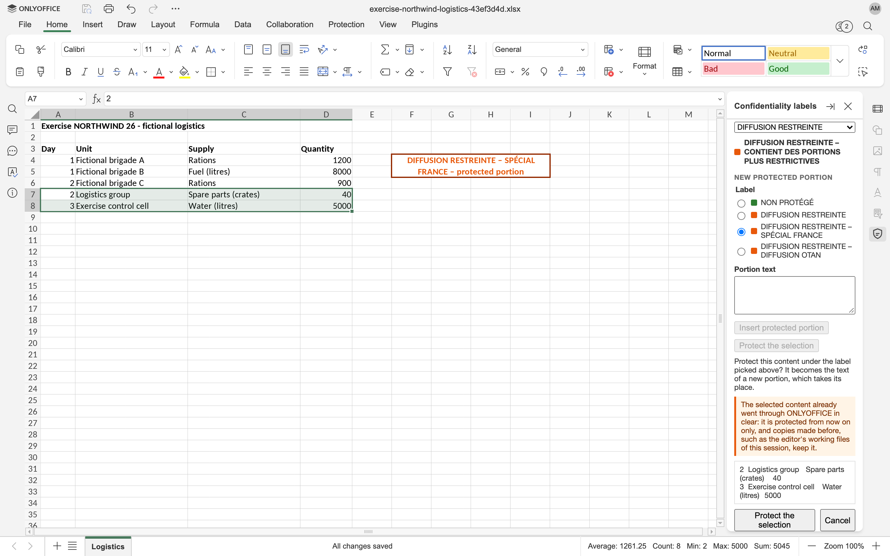

## 19. The page marking of a workbook

A workbook's page marking goes into the centre of every sheet's headers and footers, first and even pages included: the spreadsheet editor shows it only when printing, in the print preview (**File**, **Print**) and in a PDF, while the screen marking shows the document label on screen.

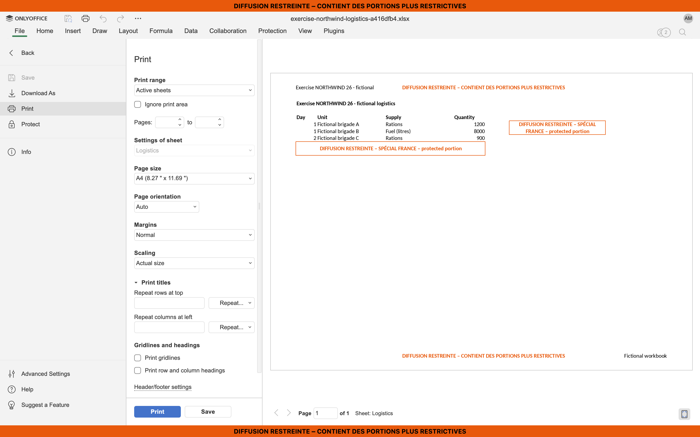

## 20. The signed binding of a workbook

Once both leave the editor, the stored workbook carries the page marking and a binding signed as a text document's, over the parts that ADatP-4778.2 lists for a workbook and those that can hold its content beyond them: `xmlsec1` verifies it the same way, as [step 8](#8-the-signed-binding) tells. This step has no picture.

## The journal

Every step that changes a label is in the portal's journal, which never holds a portion's text: in `deploy`, `docker compose logs portal | grep -E 'Base label|Portion|Document uploaded|Existing content'`.
